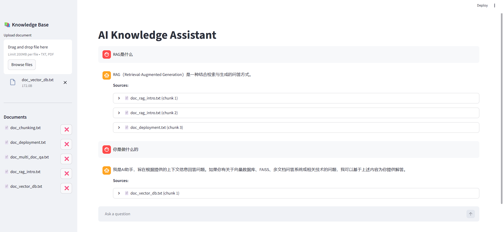

# AI Knowledge Assistant

A practical RAG (Retrieval-Augmented Generation) project with FastAPI backend + Streamlit frontend.
It supports multi-document upload, semantic retrieval, and grounded answer generation with DeepSeek API.

---

## Features

- Multi-document upload (`txt` / `pdf`) and incremental indexing
- RAG flow: document loading -> chunking -> embedding/indexing -> retrieval -> LLM answer
- Source tracing: show retrieved source chunks in UI (click to expand)
- FastAPI endpoints for upload and ask
- Streamlit chat UI for interactive QA
- Local evaluation assets (`data/rag_test_*`) for quick testing

---

## Architecture

User Query  
-> Vector Retrieval (FAISS + sentence-transformers)  
-> Context Assembly (Top-K chunks with source)  
-> DeepSeek LLM Generation  
-> Final Answer + Sources

---

## Tech Stack

- Python
- FastAPI + Uvicorn
- Streamlit
- sentence-transformers
- FAISS
- OpenAI SDK (DeepSeek-compatible API)
- python-dotenv / requests / pypdf

---

## Project Structure

```text
ai_knowledge_assistant
|-- api
|   `-- server.py
|-- service
|   `-- qa_service.py
|-- rag
|   |-- document_loader.py
|   |-- text_splitter.py
|   |-- vector_store.py
|   `-- rag_pipeline.py
|-- llm
|   `-- llm_client.py
|-- frontend
|   |-- app.py
|   `-- streamlit_app.py
|-- app
|   `-- main.py
`-- tests

data
|-- example.txt
|-- knowledge.txt
|-- rag_test_questions.txt
|-- rag_test_eval.jsonl
`-- rag_test_docs/

requirements.txt
README.md
ARCHITECTURE.md
```

---

## Installation

```bash
conda create -n ai-rag python=3.10
conda activate ai-rag
pip install -r requirements.txt
```

Create `.env` in project root:

```env
DEEPSEEK_API_KEY=your_api_key
```

---

## Run

Run from project root in **two terminals**.

Terminal 1 (backend):

```bash
uvicorn ai_knowledge_assistant.api.server:app --reload
```

Terminal 2 (frontend):

```bash
streamlit run ai_knowledge_assistant/frontend/app.py
```

---

## API Endpoints

- `GET /` : health check
- `POST /upload` : upload and index one document
- `POST /ask` : ask question, returns `answer` + `sources`

Example `/ask` request body:

```json
{"question": "What is RAG?"}
```

---

## UI Behavior

- Upload documents in sidebar
- Ask question in chat
- Assistant answer is shown with `Sources`
- Each source can be expanded to view original retrieved chunk text

UI Example:



---

## Notes

- If frontend reports connection refused to `127.0.0.1:8000`, backend is not running or failed on startup.
- If backend fails at startup, check `.env` and dependencies first.